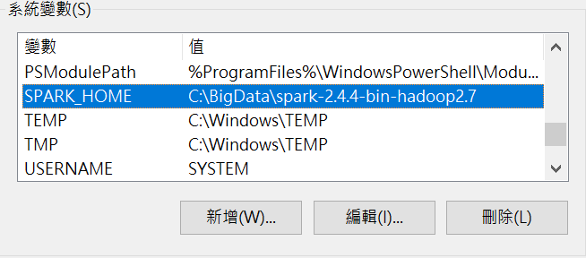
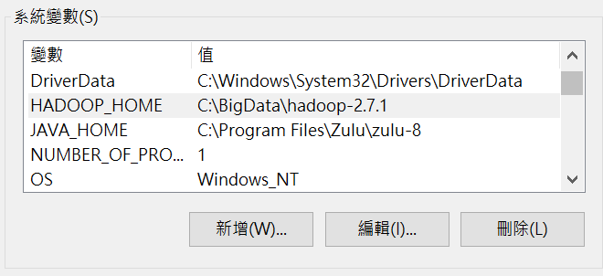
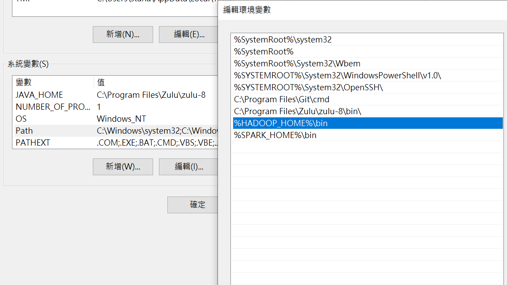

# Spark MLLib Example

## Environmental Requirements

* Java: JDK 8, version 1.8.0_212 or latter is better
* OS: Linux (CentOS would be better) or MacOS (10.13+ would be better) or Windows 10

## K-means Sample Data

``` vim
0.0 0.0 0.0
0.1 0.1 0.1
0.2 0.2 0.2
9.0 9.0 9.0
9.1 9.1 9.1
9.2 9.2 9.2
```

## How To Compiler source code to jar file

```shell script
cd mllib

# Linux OS
./gradlew clean shadowJar

# Window OS
gradlew.bat clean shadowJar
``` 

## How To Start Up The Application:

### Linux / MacOS
* [Download Spark 2.4.4](https://www.apache.org/dyn/closer.lua/spark/spark-2.4.4/spark-2.4.4-bin-hadoop2.7.tgz) and unzip file to $HOME, as well as you would have the path of spark as: 
`$HOME/spark-2.4.4-bin-hadoop2.7`, for example: `/home/user1/spark-2.4.4-bin-hadoop2.7`
* Execute `shell/start.sh` with parameter as below:  
  ```shell script
  cd shell
  bash start.sh $NumClusters $NumIterations $FilePath
  
  e.q.
  bash start.sh 3 50 /home/user1/datra/kmeans_data.txt 
  ```
  
  If successfully, you would see the result as below in command window:
  ```shell script
  INFO SparkKMeans: =========Cluster Centers========= [0.05,0.05,0.05] [9.1,9.1,9.1] [0.2,0.2,0.2] =========
  ```
  
 ### Windows 
 * Creating DIR `C:\BigData\`
 * [Download Spark 2.4.4](https://www.apache.org/dyn/closer.lua/spark/spark-2.4.4/spark-2.4.4-bin-hadoop2.7.tgz) and unzip file to `C:\BigData\`, as well as you would have the path of spark as: 
   `C:\BigData\spark-2.4.4-bin-hadoop2.7`
 * Creating directory `hadoop-2.7.1` under `C:\BigData\` and copying `windows\winutils.exe` to `C:\BigData\hadoop-2.7.1`
 * Setting `Environment Variables` for windows as below:
   * Add JAVA_HOME
   * Add SPARK_HOME
   * Add HADOOP_HOME 
   * Edit PATH and add `%HADOOP_HOME%\bin` as well as `%SPARK_HOME%\bin`
   
   SPARK_HOME
   
   
   HADOOP_HOME
   
   
   PATH
   
   
 * Create `/tmp/hive` directory under `C:\`, and set the permissions by following commands:
   ```shell script
   winutils chmod 777 /tmp/hive
   ``` 
 * Open cmd prompt and execute command :
   ```shell script
   cd spark-example-master\mllib\build\libs
   spark-submit mllib-0.0.1-SNAPSHOT-all.jar 2 20 C:\Users\stana\Downloads\kmeans_data.txt
   ```
   If successfully, you would see the result as below in command window:
     ```shell script
     19/10/22 20:23:35 INFO SparkKMeans: =========Cluster Centers========= [9.1,9.1,9.1] [0.1,0.1,0.1]=========
     ```
   And there would threw exception as below, this is OK!
   ```shell script
   19/10/22 20:23:35 ERROR ShutdownHookManager: Exception while deleting Spark temp dir: C:\Users\stana\AppData\Local\Temp\spark-b7d3a3ef-fc58-4bf1-a4ca-a22d2dba4438
   java.io.IOException: Failed to delete: C:\Users\stana\AppData\Local\Temp\spark-b7d3a3ef-fc58-4bf1-a4ca-a22d2dba4438\userFiles-513ab440-6bc6-4e1b-b0b9-b90bbfd90e5f\mllib-0.0.1-SNAPSHOT-all.jar
           at org.apache.spark.network.util.JavaUtils.deleteRecursivelyUsingJavaIO(JavaUtils.java:144)
           at org.apache.spark.network.util.JavaUtils.deleteRecursively(JavaUtils.java:118)
           at org.apache.spark.network.util.JavaUtils.deleteRecursivelyUsingJavaIO(JavaUtils.java:128)
           at org.apache.spark.network.util.JavaUtils.deleteRecursively(JavaUtils.java:118)
           at org.apache.spark.network.util.JavaUtils.deleteRecursivelyUsingJavaIO(JavaUtils.java:128)
           at org.apache.spark.network.util.JavaUtils.deleteRecursively(JavaUtils.java:118)
           at org.apache.spark.network.util.JavaUtils.deleteRecursively(JavaUtils.java:91)
           at org.apache.spark.util.Utils$.deleteRecursively(Utils.scala:1062)
           at org.apache.spark.util.ShutdownHookManager$$anonfun$1$$anonfun$apply$mcV$sp$3.apply(ShutdownHookManager.scala:65)
           at org.apache.spark.util.ShutdownHookManager$$anonfun$1$$anonfun$apply$mcV$sp$3.apply(ShutdownHookManager.scala:62)
           at scala.collection.IndexedSeqOptimized$class.foreach(IndexedSeqOptimized.scala:33)
           at scala.collection.mutable.ArrayOps$ofRef.foreach(ArrayOps.scala:186)
           at org.apache.spark.util.ShutdownHookManager$$anonfun$1.apply$mcV$sp(ShutdownHookManager.scala:62)
           at org.apache.spark.util.SparkShutdownHook.run(ShutdownHookManager.scala:216)
           at org.apache.spark.util.SparkShutdownHookManager$$anonfun$runAll$1$$anonfun$apply$mcV$sp$1.apply$mcV$sp(ShutdownHookManager.scala:188)
           at org.apache.spark.util.SparkShutdownHookManager$$anonfun$runAll$1$$anonfun$apply$mcV$sp$1.apply(ShutdownHookManager.scala:188)
           at org.apache.spark.util.SparkShutdownHookManager$$anonfun$runAll$1$$anonfun$apply$mcV$sp$1.apply(ShutdownHookManager.scala:188)
           at org.apache.spark.util.Utils$.logUncaughtExceptions(Utils.scala:1945)
   ```